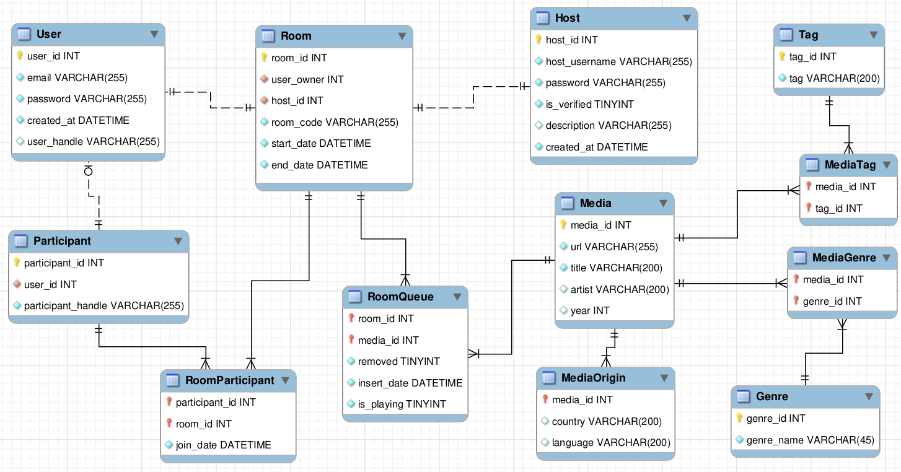

# Go Rooms

Go Rooms is a backend application written in Golang. It aims to create WebSocket rooms for users to communicate in real-time.

## Requirements

- Golang 1.22.2 or later
- MySQL 8.0 or later
- Redis 7.0 or later

## Getting Started

1. **Clone the Repository**  
   ```bash
   git clone https://github.com/your-username/go-rooms.git
   cd go-rooms
   ```
2. **Run the Application**  
   `go run main.go`

## Features

- Create and Login Users.
- Authentication and Authorization.
- Real-time Server communication with Front-End.

## To-Do

### Core Functionality

- [x] Set up basic RESTful API server
- [x] Create and authenticate Users
- [x] Create and authenticate Hosts
- [x] Ability to create new rooms by Users
- [x] Implement unique room identifiers and codes

### Error Handling

- [x] Log server-side errors for debugging
- [x] Handle API errors gracefully
- [x] Return meaningful error messages to users
- [ ] Handle unexpected WebSocket closures

### Security

- [x] Validate incoming messages and data
- [x] Prevent unauthorized access to User data
- [ ] Add rate-limiting for message frequency
- [ ] Implement basic input sanitization

## Real Time Communication

- [ ] Set up basic WebSocket server
- [ ] Create and manage WebSocket rooms
- [ ] Allow users to join and leave rooms
- [ ] Broadcast messages to all users within a room
- [ ] Implement unique room identifiers

### User Management

- [ ] Track user connections and disconnections
- [ ] Handle user reconnections gracefully
- [ ] Allow users to send private messages within a room
- [ ] Implement username or ID-based user identification

### Optimization

- [ ] Optimize WebSocket performance for multiple rooms
- [ ] Test server with high loads and concurrent connections
- [ ] Minimize memory usage for each room and user connection

### Testing

- [ ] Create unit tests for room creation logic
- [ ] Test user connection and disconnection handling
- [ ] Test broadcasting and private messaging functionality
- [ ] Implement integration tests for the entire server flow

## Database Modeling


## License

This project is licensed under the MIT License - see the [LICENSE](./LICENSE) file for details.